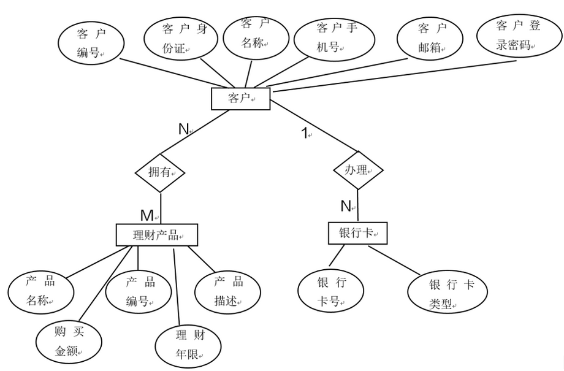
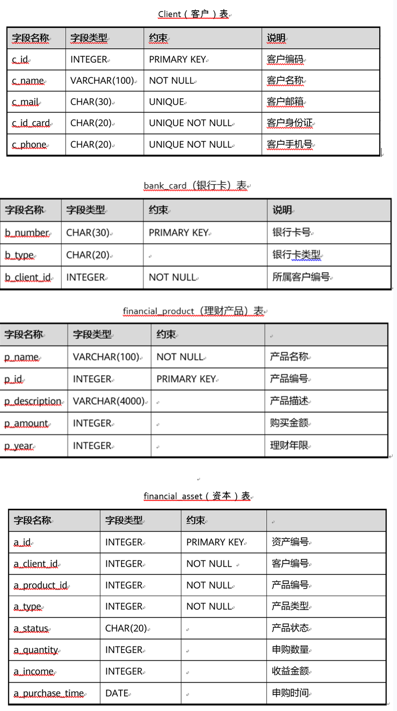
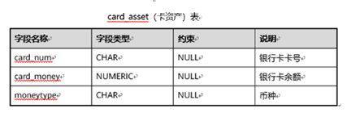

# GaussJR

金融场景下GaussDB编程综合实践

#### E-R图



#### 关系模式

对于C银行中的4个对象，分别建立属于每个对象的属性集合，具体属性描述如下：

1、客户（客户编号、客户名称、客户邮箱，客户身份证，客户手机号）

2、银行卡（银行卡号，银行卡类型，客户编号）

3、理财产品（产品名称，产品编号，产品描述，购买金额，理财年限）

4、资产表（资产编号，客户编号，产品编号，类型，状态，申购金额，收益，申购时间）

5、卡资产表（银行卡号，银行卡余额，币种）

对象之间的关系：

1、一个客户可以办理多张银行卡

2、一个客户可以购买多个理财产品

根据关系分析，设计关系模式如下图：





物理模型对象及字段属性为：

1、client(c_id，c_name，c_mail，c_id_card，c_phone)

2、bank_card(b_number，b_type，b_client_id)

3、financial_product(p_id，p_name，p_description，p_amount，p_year)

4、financial_asset(a_id, a_client_id，a_product_id，a_type，a_status，a_quantity，a_income，a_purchase_time)

5、card_asset(card_num，card_money，moneytype)

---------解决"编码 GBK 的不可映射字符"问题（-encoding utf-8）

```
cd src/expt/db/finance/

javac -encoding utf-8 -classpath ../../../ -d . *.java
---建表
java -p /d/Desktop/GaussJR/libs/opengauss-jdbc-2.0.0.jar expt.db.finance.initTables
------时数据同步
java -p /d/Desktop/GaussJR/libs/opengauss-jdbc-2.0.0.jar expt.db.finance.initData

java -p /d/Desktop/GaussJR/libs/opengauss-jdbc-2.0.0.jar expt.db.finance.testDAO
java -p /d/Desktop/GaussJR/libs/opengauss-jdbc-2.0.0.jar expt.db.finance.launch
```
优化建议 2024.6.21 from TommyNike 10:58 test

